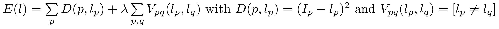

Image denoising with a CRF
==========================

Simple Python interface for GCoptimization (http://vision.csd.uwo.ca/code/).

The two examples implement the image restoration method presented on Herve
Lombaert's page (http://step.polymtl.ca/~rv101/energy/) where we minimize the
following energy of a Conditional Random Field (CRF): 

``python test_cube.py``

 &nbsp; 

``python test_lena.py``

 &nbsp; 

References
----------

Computer Vision Research Group at the University of Western Ontario:           
http://vision.csd.uwo.ca/code/

Python wrappers for GCO by Andreas Müller:        
https://github.com/amueller/gco_python

Energy minimization with Graph Cuts (Herve Lombaert):            
http://step.polymtl.ca/~rv101/energy/

"Efficient Approximate Energy Minimization via Graph Cuts".    
Y. Boykov, O. Veksler, R.Zabih. IEEE TPAMI, 20(12):1222-1239, Nov 2001.

"What Energy Functions can be Minimized via Graph Cuts?"    
V. Kolmogorov, R.Zabih. IEEE TPAMI, 26(2):147-159, Feb 2004. 

"An Experimental Comparison of Min-Cut/Max-Flow Algorithms for 
Energy Minimization in Vision".       
Y. Boykov, V. Kolmogorov. IEEE TPAMI, 26(9):1124-1137, Sep 2004.
